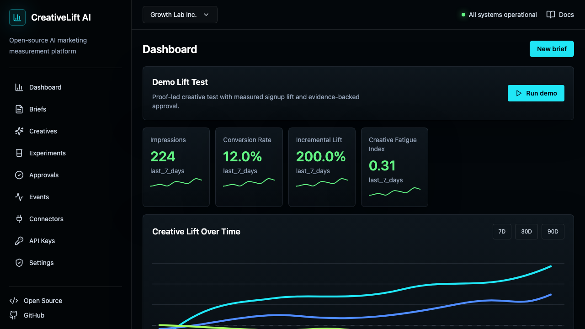
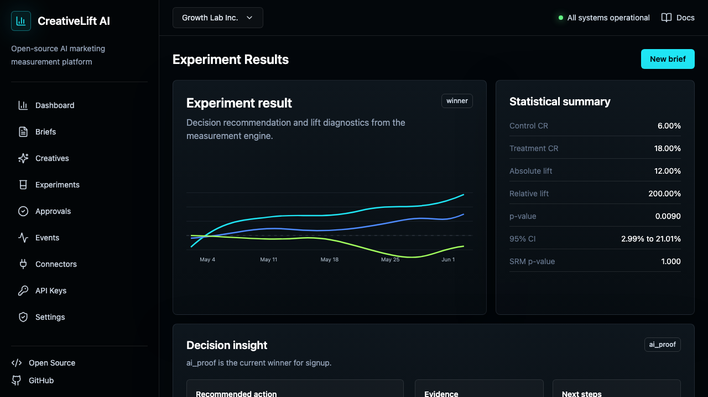
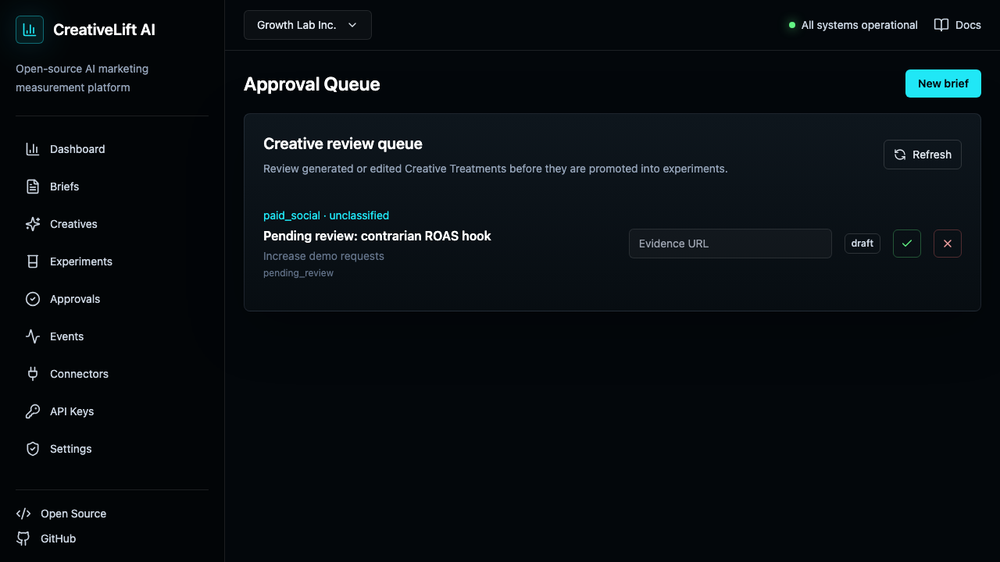
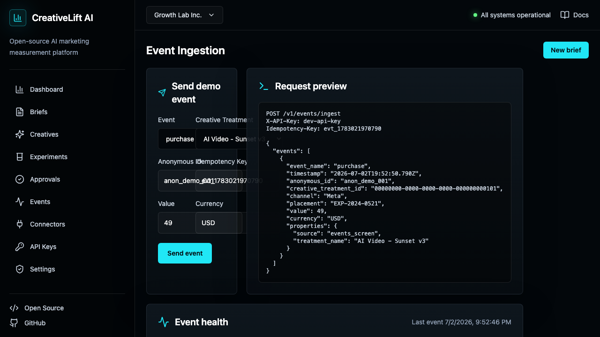
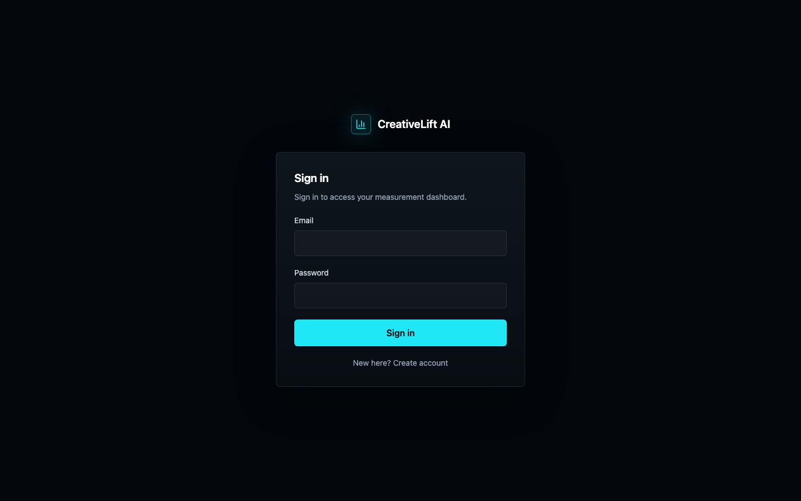

# CreativeLift AI

**From prompt to profit: measure which AI creatives actually lift revenue.**

[](#credits)
[](https://github.com/Hiberius/creativelift-ai/actions/workflows/ci.yml)
[](LICENSE)
[](apps/api/pyproject.toml)
[](apps/web/package.json)
[](#verified-not-just-promised)

AI made content infinite. Measurement became the bottleneck. Your team can generate 50 ad variants in an hour — but platform ROAS can't tell you which one creates **incremental revenue**. CreativeLift AI is a self-hosted **marketing attribution and incrementality testing platform**: an open-source A/B testing and experimentation stack that tracks every AI-generated creative from **brief → prompt → approval → experiment → events → causal lift → decision**, with sequential testing (mSPRT), SRM checks, Thompson-sampling bandits, and a marketing mix modeling (MMM) service built in.

*Built end-to-end by AI agents: Claude Fable 5 in ultracode multi-agent mode + the latest OpenAI Codex — see [Credits](#credits).*



## What it does

- **Creative Treatments** — every variant becomes a versioned, measurable unit: prompt lineage, hook, CTA, offer, compliance status, spend, revenue, lift.
- **Governance before spend** — approval queue with brand guardrails; experiments refuse to launch if approved claims lack evidence.
- **Real experiments, real statistics** — deterministic assignment, lift with confidence intervals, p-values, SRM (broken-randomization) checks, CUPED variance reduction, **always-valid sequential testing (mSPRT)** so you can peek without inflating false positives, and a plain-language recommendation: promote, retire, or keep collecting.
- **Event ingestion that survives restarts** — idempotent API/SDK ingestion into Postgres, with event-quality snapshots you can trend over time.
- **AI generation with lineage** — plug any OpenAI-compatible endpoint; every generated variant records model, prompt, and token usage. A deterministic mock provider keeps the quickstart free.
- **Connector sync that works today** — push raw payloads from any of the 7 adapters (`POST /v1/connectors/{id}/sync`) or pull straight from PostHog, with idempotent replay and per-sync quality snapshots.



## Quickstart

The persistent profile (Postgres, migrations on boot):

```bash
cp .env.example .env
docker compose up --build
```

Open http://localhost:3000 (dashboard) and http://localhost:8000/docs (API). Click **Run demo** on the dashboard to seed a fully measured experiment — 224 events, computed lift, a decision — then restart the stack and watch the data survive.

No Docker? The zero-dependency lab runs entirely in memory:

```bash
python3 -m pytest          # 171 tests, no database needed
cd apps/api && python3 -m uvicorn app.main:app   # then open http://localhost:8000/demo
```

## The loop

```text
brand pack → brief → AI variants → creative treatment → approval (claims need evidence)
   → experiment → event ingestion → lift + SRM + confidence → promote / retire
```

| | |
|---|---|
|  |  |
| Governance: review every treatment before it spends | Ingestion health with persisted quality trend |

Track events from your site or server in a few lines:

```bash
curl -X POST http://localhost:8000/v1/events/ingest \
  -H "Authorization: Bearer <your-api-key>" \
  -H "Idempotency-Key: evt_001" \
  -H "Content-Type: application/json" \
  -d '{"events": [{"event_name": "purchase", "timestamp": "2026-07-02T10:00:00Z",
       "anonymous_id": "anon_123", "creative_treatment_id": "<treatment-id>",
       "experiment_id": "<experiment-id>", "variant_id": "treatment",
       "value": 149.0, "currency": "USD"}]}'
```

Python and TypeScript SDKs live in [packages/](packages/), browser/server tracking examples in [examples/sdk-tracking/](examples/sdk-tracking/).

## Security by default

- **Human login with revocable sessions** — email + password (stdlib scrypt hashing), httpOnly session cookies, logout that actually revokes server-side. **RBAC**: viewers can't approve creatives, only owners/admins manage API keys, service keys can't impersonate humans.
- **Row-Level Security in Postgres** — every tenant table carries a FORCEd isolation policy tied to the authenticated organization; the runtime connects as a non-superuser role, so even an application bug can't read another tenant's rows. Proven by the migration smoke test.
- API keys are stored **HMAC-SHA256 hashed** (peppered) and resolved against the database — the raw key is shown exactly once. **Scoped keys** (`events:write`, …) enforced per endpoint; revocation is immediate.
- **Production guards**: the API refuses to boot in production with development credentials, and demo fallbacks are disabled outside development.
- Security headers on every response, CSP on the demo console, strict CORS, request-size limits, **Redis-backed rate limiting** with in-memory fallback.
- **Non-root containers**, daily **database backups** with 14-day retention, and CI runs `pip-audit`, `bandit`, and `npm audit` on every push.



## Verified, not just promised

| Check | What actually runs |
|---|---|
| `python3 -m pytest` | 171 tests: API workflows, both storage backends, human auth + RBAC, idempotency, statistics, connectors |
| `make test-sqlalchemy` | The SQLAlchemy backend exercised on SQLite: parity, tenancy, hashing |
| `make migration-smoke` | Alembic upgrade → downgrade → re-upgrade, plus an RLS test proving tenant A cannot read tenant B |
| `make e2e` | 8 Playwright journeys (incl. register → dashboard → logout) against the production build and a live RLS-enforced Postgres |
| `docker compose restart api` | Ingested events, snapshots, and audit logs survive — persistence is real |

Every screenshot in this README was captured by the E2E suite from the running product.

## Architecture

```text
apps/web                   Next.js 15 dashboard (dark, fast, no template feel)
apps/api                   FastAPI · repository boundary with two backends:
                           in-memory (zero-dep quickstart) and SQLAlchemy/Postgres
services/experiment-engine Lift, SRM, CUPED statistics
services/bandit-service    Thompson Sampling
services/uplift-service    Segment-level uplift baseline
services/mmm-service       Media-mix modeling scaffold
connectors/*               7 adapters (Google Ads, Meta, PostHog, HubSpot, Snowplow, Rudder, webhook)
packages/*                 Shared schemas + Python/TS SDKs
```

Deep dives: [How it works](docs/how-it-works.md) · [Measurement methodology](docs/measurement-methodology.md) · [Self-hosting](docs/self-hosting.md) · [Honest implementation status](docs/implementation-status.md) · [API reference](docs/api-reference.md)

## FAQ

**How is this different from platform ROAS or last-click attribution?**
Platform-reported ROAS credits whatever the platform touched. CreativeLift AI runs real randomized experiments and reports **causal incremental lift** — with confidence intervals, SRM validity checks, and always-valid sequential testing so you can stop early without inflating false positives.

**Can I self-host it?**
Yes — that's the point. `docker compose up` gives you Postgres persistence, migrations, human login, and Row-Level Security multi-tenancy on your own infrastructure. No data leaves your servers.

**Does it work with Meta Ads, Google Ads, PostHog, or my CRM?**
Seven connector adapters ship today (Google Ads, Meta Ads, HubSpot, PostHog, Snowplow, RudderStack, generic webhook). Push raw payloads to `POST /v1/connectors/{id}/sync` from any of them, or pull directly from PostHog. Scheduled sync is on the roadmap.

**Is it production-ready?**
Read the honest answer in [implementation status](docs/implementation-status.md): the measurement loop, auth, RLS tenancy, and persistence are real and tested (171 unit + 8 E2E). Scheduled connectors and OIDC/SSO are still roadmap.

**Do I need an OpenAI key?**
No. A deterministic mock provider powers the quickstart for free; plug any OpenAI-compatible endpoint when you want real AI variant generation with full prompt lineage.

## Roadmap

- **v0.2** — scheduled connector sync and more live pulls (GA, ad platforms), ClickHouse event store, connector UI
- **v0.3** — contextual bandits, MMM calibration, warehouse-native exports

The [implementation status](docs/implementation-status.md) page says plainly what is working, what is demo, and what is scaffold — we'd rather under-promise.

## The skill behind it

The statistics this platform runs on are packaged as an Agent Skill you can use without
deploying anything:

**[incrementality-testing](https://github.com/Hiberius/incrementality-testing)** — sample
ratio mismatch, an always-valid sequential test that survives daily peeking, CUPED
variance reduction, and the geo and holdout designs for channels where you cannot
randomise users. Standard library only, no SciPy.

```
npx skills add Hiberius/incrementality-testing
```

It is one of [ten](https://github.com/Hiberius/hiberius-skills) built the same way.

## Contributing

Issues and PRs welcome — see [CONTRIBUTING.md](CONTRIBUTING.md). Good first areas: a new live connector pull, connector scheduling, contextual bandits, dashboard polish.

## Work with me

CreativeLift AI is what happens when a performance marketer gets tired of guessing which creative actually makes money — and builds the measurement stack he always wanted.

I design and ship **custom AI automations for businesses**: measurement pipelines like this one, AI-powered creative and campaign workflows, lead-gen and CRM automation, and internal tools that turn hours of manual work into minutes. This entire repository — statistics engine, security hardening, E2E suite — was built by orchestrating AI agents, and I bring that same leverage to client work.

**Open to collaborations and consulting.** If your company wants automation built around its own stack, reach out via [GitHub @Hiberius](https://github.com/Hiberius) or [open a discussion](https://github.com/Hiberius/creativelift-ai/discussions) — tell me what you're trying to automate and I'll tell you honestly whether it's worth building.

## Credits

Built end-to-end with **Claude Fable 5** running in **ultracode** multi-agent mode — parallel agent swarms handled the statistics engine, connector layer, security hardening, and frontend — together with the latest **OpenAI Codex**. Every screenshot in this README was captured by the E2E suite the agents wrote for themselves. Humans set the direction; agents wrote the code; the test suite kept everyone honest.

Licensed under [Apache 2.0](LICENSE).
