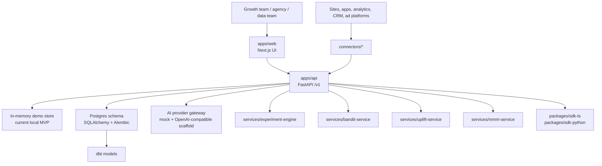

# Architecture

CreativeLift AI is a modern monorepo:

- `apps/web`: Next.js App Router marketing site and SaaS dashboard.
- `apps/api`: FastAPI REST API with OpenAPI docs, middleware, service layer, and SQLAlchemy/Alembic schema.
- `services/experiment-engine`: statistical lift, SRM, CUPED, and decision routines.
- `services/bandit-service`: Thompson Sampling scaffold.
- `services/uplift-service`: uplift modeling interface.
- `services/mmm-service`: marketing mix modeling run interface.
- `connectors`: analytics, warehouse, CRM, ad platform, and webhook scaffolds.
- `packages`: shared schemas and SDKs.

## Data Flow

1. Marketer creates a brief and brand guardrails.
2. Generator provider creates variants and prompt lineage.
3. A Creative Treatment is approved or rejected.
4. Experiment registry assigns treatments to variants.
5. Event ingestion records impressions, clicks, conversions, and revenue.
6. Measurement engine computes lift, confidence, SRM, and recommendations.
7. Attribution and MMM systems consume calibrated events/results.

## System Diagram

## Runtime Today vs Target

Today:

- API routes use demo/in-memory stores for fast local behavior.
- Full Postgres schema and migrations are present.
- Measurement functions are real Python routines with tests.
- Connectors are contract-tested scaffolds.

Target:

- API routes use Postgres repositories.
- Events optionally move to ClickHouse for volume.
- Redis backs rate limiting, queues, and cache.
- Workers compute measurement jobs asynchronously.
- Connectors perform live scheduled syncs.
- Auth provider and RLS enforce production tenant isolation.

## Runtime

Local Docker Compose runs:

- Next.js web
- FastAPI API
- Postgres
- Redis

Workers, ClickHouse, object storage, and managed observability are planned production additions.
