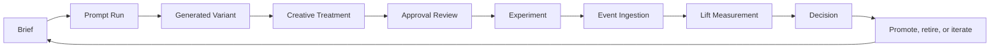
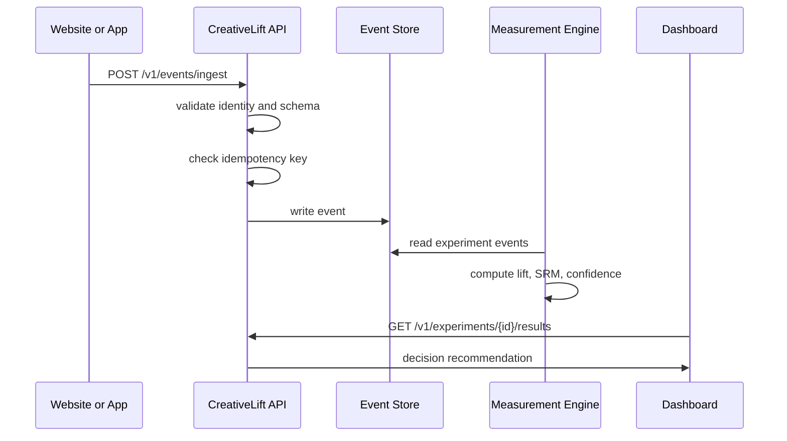

# How CreativeLift AI Works

CreativeLift AI measures AI-generated marketing creative from the moment a team writes a brief to the moment a variant creates incremental revenue.

It is not an AI copywriter. It is the measurement system around AI creative production.

## The Core Loop

## In Plain English

1. A marketer creates a brief.
2. The brief defines objective, audience, channel, KPI, guardrails, and claims.
3. The AI generator creates variants from that brief.
4. Each variant becomes a Creative Treatment.
5. A reviewer approves or rejects the treatment.
6. Approved treatments are attached to experiments.
7. Websites, apps, ad platforms, CRMs, or analytics tools send events into CreativeLift AI.
8. The measurement engine compares control vs treatment.
9. The system recommends winner, loser, inconclusive, invalid SRM, or needs more data.
10. The team uses the result to promote, retire, or iterate the creative.

## The Central Object

The central object is a Creative Treatment.

A Creative Treatment is a measurable version of a creative idea. It stores:

- brief
- prompt lineage
- generated copy and metadata
- channel and placement
- audience and objective
- angle, hook, CTA, offer
- model and provider
- brand guardrails
- approved claims
- human edits
- approval status
- experiment assignment
- spend, events, revenue, and lift

Campaigns are not the center. Creative Treatments are.

## What The MVP Does Today

The MVP currently has:

- a Next.js marketing site and product dashboard
- a FastAPI backend with `/v1` endpoints
- SQLAlchemy models and Alembic migration for the full core schema
- local demo data
- event ingestion validation
- idempotency shape for retries
- mock AI variant generation
- OpenAI-compatible provider scaffold
- experiment result endpoint
- statistical functions for conversion lift, p-values, confidence intervals, SRM, and CUPED
- bandit, uplift, MMM, and connector scaffolds

## What Is Demo Data vs Production Path

The current API uses an in-memory demo store for fast local behavior. The real database schema already exists under:

- `apps/api/app/db/models.py`
- `apps/api/alembic/versions/0001_initial_schema.py`

The production path is to move each API route from the demo store to repository classes backed by Postgres, while preserving the same API contracts.

## Event Flow

## Decision Output

CreativeLift AI should answer:

- Which creative won?
- Which prompt created it?
- Which audience responded?
- Which claim, CTA, hook, or offer drove lift?
- Is the winner statistically credible?
- Did assignment break through sample ratio mismatch?
- Should the team promote, retire, or iterate?

## Why This Is Different

Most tools start from generation, attribution, or analytics. CreativeLift AI starts from the measurable creative treatment and connects it to all three:

- generation provenance
- experiment measurement
- attribution/MMM calibration
